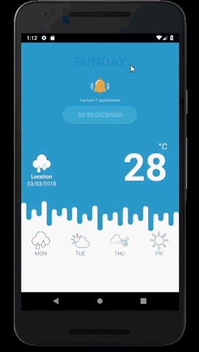

# Weather Application

## Assignment #3



Get JSON file from API

```
@Override
protected String doInBackground(String... strings) {

String stringUrl = "http://apis.juhe.cn/simpleWeather/query?city=%E9%87%8D%E5%BA%86&key=ea21c3c747bf2b853410b7c245e8f23c";
HttpURLConnection urlConnection = null;
BufferedReader reader;

try {
    URL url = new URL(stringUrl);

    // Create the request to get the information from the server, and open the connection
    urlConnection = (HttpURLConnection) url.openConnection();

    urlConnection.setRequestMethod("GET");
    urlConnection.connect();

    // Read the input stream into a String
    InputStream inputStream = urlConnection.getInputStream();
    StringBuffer buffer = new StringBuffer();
    if (inputStream == null) {
        // Nothing to do.
        return null;
    }
    reader = new BufferedReader(new InputStreamReader(inputStream));

    String line;
    while ((line = reader.readLine()) != null) {
        buffer.append(line + "\n");
    }

    if (buffer.length() == 0) {
        // Stream was empty.  No point in parsing.
        return null;
    }

    showWeather(buffer.toString());
        return buffer.toString();

    } catch (MalformedURLException e) {
        e.printStackTrace();
    } catch (ProtocolException e) {
        e.printStackTrace();
    } catch (IOException e) {
        e.printStackTrace();
    }
    return null;
}

```

Handle the JSON data

```
private void showWeather(String str_json){
try{
    JSONObject json_weather_msg = new JSONObject(str_json);
    String str_weather_result = json_weather_msg.get("result").toString();
    JSONObject json_weather_result = new JSONObject(str_weather_result);
    String str_weather_forcast = json_weather_result.get("future").toString();
    JSONArray jsonArray_weather_forcast = new JSONArray(str_weather_forcast);
    for(int i=0; i<5; i++){
        DailyWeather dailyWeather = new DailyWeather();
        JSONObject json_weather = jsonArray_weather_forcast.getJSONObject(i);

        // 获取日期
        String str_date = json_weather.get("date").toString();
        dailyWeather.m_strDate = str_date;

        // 获取星期
        SimpleDateFormat sdf = new SimpleDateFormat("yyyy-MM-dd");
        Date date = sdf.parse(str_date);
        SimpleDateFormat sdf2 = new SimpleDateFormat("EEEE");
        String str_week = sdf2.format(date);
        dailyWeather.m_strDay = str_week;


        // 获取温度
        String str_temperature = json_weather.get("temperature").toString();
        dailyWeather.m_strTemperature = str_temperature.split("/")[0];

        // 获取天气
        String str_weather = json_weather.get("weather").toString().split("转")[0];

        dailyWeather.m_strWeather = R.drawable.partly_sunny_small;

        if(str_weather.indexOf("晴")>= 0){
            dailyWeather.m_strWeather = R.drawable.sunny_small;
        }
        if(str_weather.indexOf("雨")>= 0){
            dailyWeather.m_strWeather = R.drawable.rainy_small;
        }
        if(str_weather.indexOf("阴")>= 0){
            dailyWeather.m_strWeather = R.drawable.partly_sunny_small;
        }
        if(str_weather.indexOf("云")>= 0){
            dailyWeather.m_strWeather = R.drawable.windy_small;
        }

        m_vDailyWeather.add(dailyWeather);
    }
}
catch (Exception e){
    e.printStackTrace();
}
}
```

Update the weather 

```
@Override
protected void onPostExecute(String temperature) {
    ((TextView) findViewById(R.id.temperature_of_the_day)).setText(m_vDailyWeather.get(0).m_strTemperature);

    ((TextView) findViewById(R.id.tv_date)).setText(m_vDailyWeather.get(0).m_strDate);
    ((TextView) findViewById(R.id.dayView)).setText(m_vDailyWeather.get(0).m_strDay);
    ((TextView) findViewById(R.id.day_1)).setText(m_vDailyWeather.get(1).m_strDay);
    ((TextView) findViewById(R.id.day_2)).setText(m_vDailyWeather.get(2).m_strDay);
    ((TextView) findViewById(R.id.day_3)).setText(m_vDailyWeather.get(3).m_strDay);
    ((TextView) findViewById(R.id.day_4)).setText(m_vDailyWeather.get(4).m_strDay);


    ((ImageView) findViewById(R.id.img_weather_condition)).setImageDrawable(ContextCompat.getDrawable(getApplicationContext(),m_vDailyWeather.get(0).m_strWeather));
    ((ImageView) findViewById(R.id.weather_1)).setImageDrawable(ContextCompat.getDrawable(getApplicationContext(),m_vDailyWeather.get(1).m_strWeather));
    ((ImageView) findViewById(R.id.weather_2)).setImageDrawable(ContextCompat.getDrawable(getApplicationContext(),m_vDailyWeather.get(2).m_strWeather));
    ((ImageView) findViewById(R.id.weather_3)).setImageDrawable(ContextCompat.getDrawable(getApplicationContext(),m_vDailyWeather.get(3).m_strWeather));
    ((ImageView) findViewById(R.id.weather_4)).setImageDrawable(ContextCompat.getDrawable(getApplicationContext(),m_vDailyWeather.get(4).m_strWeather));
}
```